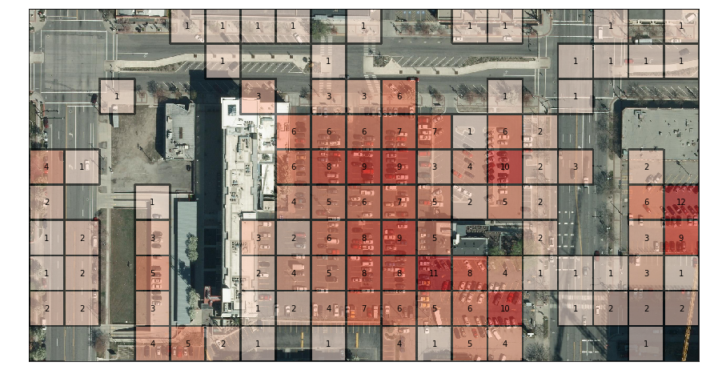
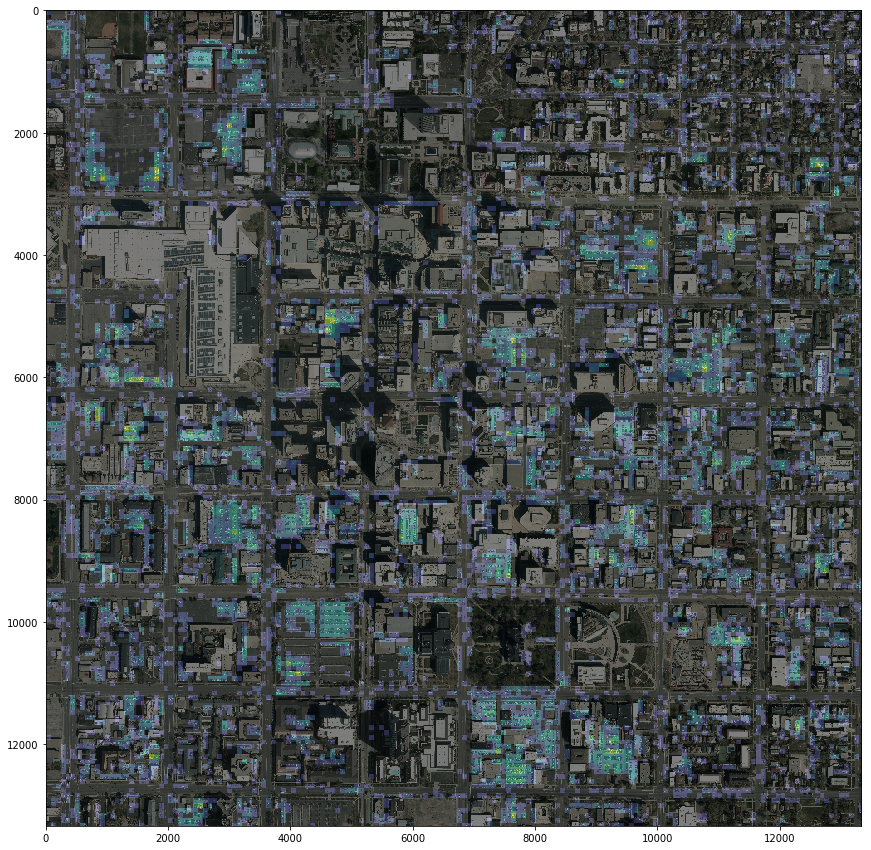
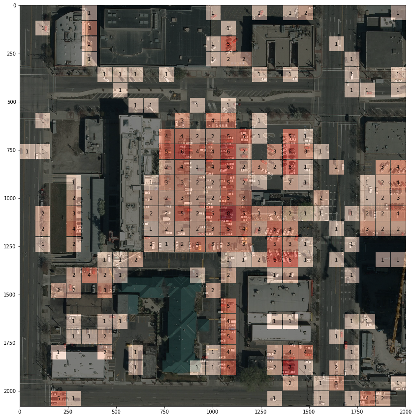

# COWC Car Counting
This repository privides some python scripts and jupyter notebooks to train and evaluate convolutional neural networks which count cars from [COWC](https://gdo152.llnl.gov/cowc/) aerial images.



## Dependency

* [NVIDIA Driver](https://www.nvidia.com/Download/index.aspx)
* [NVIDIA Docker](https://github.com/NVIDIA/nvidia-docker)

## Usage

### 0. Clone this repo

```
$ PROJ_DIR=~/cowc_car_counting  # assuming you clone this repo to your home directory

$ git clone https://github.com/motokimura/cowc_car_counting.git $PROJ_DIR
```

### 1. Download COWC dataset

Download [COWC](https://gdo152.llnl.gov/cowc/) aerial images and annotations from FTP server. 

```
$ cd $PROJ_DIR/src/data
$ bash download_cowc.sh
```

### 2. Build Docker image

Build docker image to setup the environment to preprocess COWC dataset and train/evaluate convolutional neural networks. 

```
$ cd $PROJ_DIR/docker
$ bash build.sh
```

In case you don't want to use docker, you have to install additional dependencies described in [Dockerfile](docker/Dockerfile).

### 3. Preprocess COWC dataset

Generate crops from COWC train/val scenes defined in [this text file](data/cowc_processed/train_val/train_val_scenes.txt).

Run docker container by following:

```
$ cd $PROJ_DIR/docker
$ bash run.sh
```

Now you should be inside the docker container you ran. Generate train/val crops by following:

```
$(docker) cd /workspace/src/features
$(docker) python gen_train_val_crops.py
```

In `$PROJ_DIR/data/cowc_processed/train_val/crop/data`, 
you should find many crops in which image and label are placed side by side like shown below.
If you are interested in how train/val crops are sampled, 
please see [this notebook](notebooks/features/visualize_train_val_crop_distrib.ipynb).


Then, compute mean image over train crops. 
This will be used to normalize crops before input them to the network.

```
$(docker) cd /workspace/src/features
$(docker) python compute_mean.py
```

### 4. Train ResNet-50

Train ResNet50 with generated crop images by following: 

```
$(docker) cd /workspace/src/models
$(docker) python train_model.py
```

You can check training status and validation accuracy from TensorBoard:

```
# Open another terminal window outside the container and type:
$ cd $PROJ_DIR/docker
$ bash exec.sh

# Now you should be inside the container already running. Start TensorBoard by following:
$(docker) tensorboard --logdir /workspace/models
```

Then, open `http://localhost:6006` from your browser.


### 5. Evaluate the network

Evaluate ResNet50 with jupyter notebook.

Launch jupyter notebook by flollowing:

```
$(docker) cd /workspace/notebooks
$(docker) jupyter notebook
```

Then, open `http://localhost:8888` from your browser.

Note that you may need to modify the path to pre-trained model defined in the notebooks below.

#### 5.1 Quantitative evaluation

Open [this notebook](notebooks/models/evaluate_model.ipynb) 
to see quantitative evaluation on the test scenes defined in 
[this text file](data/cowc_processed/test/test_scenes.txt). 

#### 5.2 Qualitative evaluation

Open [this notebook](notebooks/visualization/visualize_count_results.ipynb) 
to see qualitative evaluation on a test scene. 

Distribusion of the cars counted by the network in a test scene (Salt Lake City):





#### 5.3 Class activation mapping

Open [this notebook](notebooks/visualization/show_cam_on_val_crops.ipynb) 
to see [class activation mapping](https://github.com/metalbubble/CAM) on validation crops. 

Output examples:


## License

[MIT License](LICENSE)
